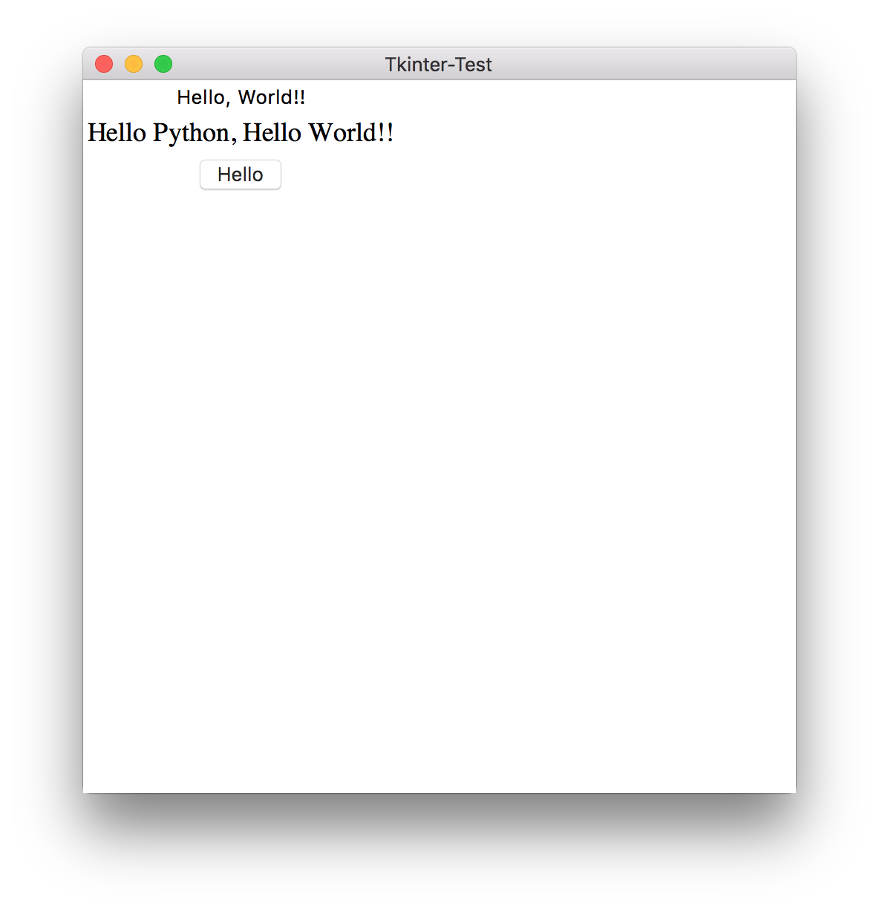

# tkinter module  

[https://docs.python.jp/3/library/tkinter.html](https://docs.python.jp/3/library/tkinter.html)  


```python

import tkinter as tk

```


---  

### 00.py

### 01-tkinter.py  

label  
bottun  
command  
def  
root.destroy  
frame  

  


---  


### Reference  

[https://qiita.com/yusk24/items/3af56d0599be200559de](https://qiita.com/yusk24/items/3af56d0599be200559de)  

[http://www.geocities.jp/m_hiroi/light/pytk01.html](http://www.geocities.jp/m_hiroi/light/pytk01.html)  

[https://qiita.com/canard0328/items/5ea096352e160b8ececa](https://qiita.com/canard0328/items/5ea096352e160b8ececa)  

[https://qiita.com/yosgspec/items/810843f863075d33a093](https://qiita.com/yosgspec/items/810843f863075d33a093)  

[https://qiita.com/narupo/items/04e02093f08142fa8f1a](https://qiita.com/narupo/items/04e02093f08142fa8f1a)  

